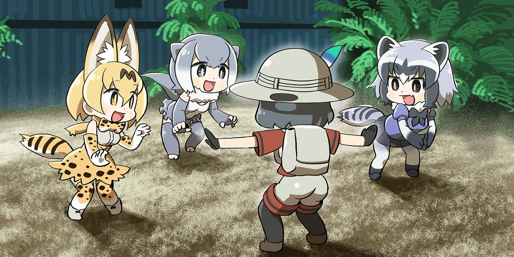
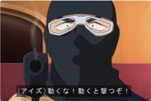
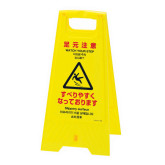
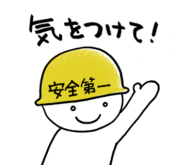
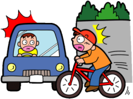
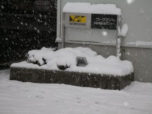
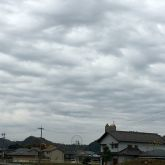
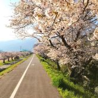
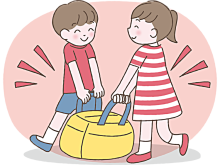
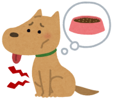

# 英会話この順序で覚えれば絶対だ

> 例文：[**纯享合集版**](all.html)

[TOC]

## <small>[20191204]</small> さがれ！

**さがれ！**

**退后！**

Stand back! / Get back! / Back off!

 

| 单词   | 发音   |
| ------ | ------ |
| 下がる | さがる |

日语在发号施令的时候，需将命令动词变为命令形使用。

虽然生活中很少命令别人，但命令形在「紧急时刻」比如地震火灾呼喊大家快跑，或者「加油助威」比如看足球比赛让球员快跑，这种场合还是会经常使用的。

下がる这个词有向「下」移动和向「后」移动两种意思。

下がる这个词是第１类动词，第１类动词变命令形，需将该动词的ます形去ます后，再将末尾假名变到え段即可。

比如下がる变ます形是下がります，去掉ます后剩下がり，末尾假名り对应的え段假名是れ，即再把り变成れ即可，也就是下がれ！意思就是命令他人退后，注意要读出命令的口气。

注意：当你用输入法打さがる的时候会出现退がる候选词，但是退がる这个汉字是错误的，日语里さがる的正确当用汉字只有下がる。虽然退がる明显更符合退后的含义，之所以现在不用这个字可能有历史和规范的原因我们不深究，记住要么只写假名さがる，写汉字的话就写下がる即可。

## <small>[20191127]</small> そのまま動くな！

**そのまま動くな！**

**待着别动！**

Hold it!

 

| 单词   | 发音     |
| ------ | -------- |
| 其の儘 | そのまま |
| 動く   | うごく   |

その，意思是那个。まま，意思是状态。そのまま，那个状态。日语汉字写作「其の儘」，一般只写假名。古汉语中「其」就是「那个」的意思；儘就是尽，逝者如斯、万物消尽，所谓自然流转，用以指代状态。

動く，动词，意思是动，泛指有所动作、行动。

日语表达禁止命令的方法是在动词原形后面+な，这种动词变形也被称为禁止形，也就是禁止…、不许… 做某事的意思。比如食べる是吃，食べるな就是不许吃的意思。

そのまま，就是保持原样。動くな，就是不许动。连在一起，直译就是保持原样不许动；为了增强禁止形的气势，我们意译为待着别动！

## <small>[20191126]</small> 足元に気をつけて！

**足元に気をつけて！**

**留神脚下！**

Watch your step!

**手元に気をつけて！**

**手上加小心！**

Watch your fingers!

**頭の上に気をつけて！**

**当心头顶！**

Watch your head!

 

| 单词 | 发音   |
| ---- | ------ |
| 足   | あし   |
| 手   | て     |
| 元   | もと   |
| 頭   | あたま |
| 上   | うえ   |

元（もと）有开始的意思，且古代与圆通用。无论是足元还是手元，都是指从足或手开始周边一圈儿的范围，理解为脚下、手边。

上（うえ）就是汉语上的意思，头的上面不就是头顶么。

以上这三句话可以根据情境理解为「小心地滑」「当心台阶」、「当心夹手」「当心烫手」和「小心碰头」「当心头顶」等。

## <small>[20191121]</small> 気をつけて！

**気をつけて！**

**加小心！**

Be careful.

 

| 单词                           | 发音   |
| ------------------------------ | ------ |
| 気                             | き     |
| 付ける・着ける・漬ける・点ける | つける |

気是只有东亚文明才能理解的一种概念，一种虚无的能量，它发挥作用时又能化生实体。很玄！日语里和気有关的说法不胜枚举，但意思却都是只可意会不可言传的，不能理解的话就先死记住，直到将来有一天能理解它或者不在乎它。

つける是日语中另一个很玄的概念，汉语中的粘、连、黏、随，乃至接触、靠近、浸透、腌制等等意象，都可以用つける来表达。故而，つける的日语当用汉字有很多写法，不一而足。所以，日本人为了避免用字不准，一般也都只写平假名。

那么，気を付ける的意思就是「粘上气」。

我们把动词变成て形+ください，就可以表达请做某事。

比如気をつけてください就是「请粘上气」，而它真正的意思是「请小心一点儿」。我特别喜欢我姥爷的说法，每次我骑车上学他都会嘱咐我「加小心！」，这个「加」字把つける这个词翻译得真好。

另外，つける是二类动词，变て形去掉る（ます）直接加て即可。

## <small>[20191120]</small> 危ない！

**危ない！**

**危险！**

Watch out! / Look out!

 

| 单词   | 发音     |
| ------ | -------- |
| 危ない | あぶない |

危ない是形容词，危险的。常用在遭遇惊险的时候大声喊出。

注意：ない并不是表达否定的那个ない，危ない是一个词，い结尾的い形容词。

## <small>[20191118]</small> 傘をさしました。

**傘をさしました。**

**撑起了雨伞。**

I put up my umbrella. 

**傘を閉じました。**

**合上了雨伞。**

I closed my umbrella.

 

| 单词   | 发音   |
| ------ | ------ |
| 傘     | かさ   |
| 差す   | さす   |
| 閉じる | とじる |

傘，名词，伞。注意写法。

差す，动词，撑开。你看差的羊字头，像不像什么东西撑开的样子。

閉じる，动词，合上。本意是闭合以恢复原样。

## <small>[20191116]</small> 雪が降っています。

**雪が降っています。**

**正在下雪。**

 

| 单词 | 发音 |
| ---- | ---- |
| 雪   | ゆき |
| 降る | ふる |

## <small>[20191115]</small> 曇っています。

**曇っています。**

**正阴天。**

 

| 单词 | 发音   |
| ---- | ------ |
| 曇る | くもる |

## <small>[20191113]</small> 雨が降っています。

**雨が降っています。**

**正在下雨。**

 

| 单词 | 发音 |
| ---- | ---- |
| 雨   | あめ |
| 降る | ふる |

降る是「一类动词」，意思是降落。

动词变现在进行时，先变て形，再加いる。

变て形先变ます形，去掉ます，末尾假名是いちり，则变促音加て。口诀：いちり、促音变。降り，末尾是り，符合规则。

降る => 降ります => 降り => 降って => 降っている。

为了更加礼貌，いる再变います，即简体变ます形。

降っている => 降っています。

主语是雨，直译是雨正下着，意译为正在下雨。

## <small>[20191111]</small> 晴れています。

**晴れています。**

**正晴。**

 

| 单词   | 发音   |
| ------ | ------ |
| 晴れる | はれる |

晴れる是自动词，放晴、晴朗的意思。

日语动词变て形+いる，表示动作的现在进行时。

晴れる是二类动词，变て形直接在ます形去掉ます的基础上加て即可。晴れる、晴れます、晴れて。

晴れている是简体形式，变成ます更加礼貌，即晴れています。天空、天气也好，今天、现在也罢，主语省略了，表达的意思就是正晴着呢。

## <small>[20191110]</small> 彼と会うのが楽しみだなあ。

**彼と会うのが楽しみだなあ。**

**我好期待和他见面啊。**

 

| 单词   | 发音     |
| ------ | -------- |
| 彼     | かれ     |
| 会う   | あう     |
| 楽しみ | たのしみ |

彼是男「他」的意思。

会う是见面，所谓相会。

彼と会う，和他见面。

动词原形+の变名词，彼と会うの，和他见面这件事儿。

が，提示前方部分是主语。和他见面这件事儿怎么了？

楽しみです。楽しみ是期待的意思，名词，对于将来可能开心快乐的事情的一种期待。

です简体化变だ，なあ是语气助词。

## <small>[20191106]</small> 週末はどこかへ行きたいなあ。

**週末はどこかへ行きたいなあ。**

**周末好想去什么地方玩儿啊。**

 

| 单词 | 发音       |
| ---- | ---------- |
| 週末 | しゅうまつ |

どこ，疑问词，哪里。

疑问词+か＝不确定，表达一种不确定的语气，不确定是哪里，反正是个地方。

へ，助词，表示动作的方向。どこかへ，向着不确定是哪里的地方。

行きたい，想去。なあ，语气助词，常常跟在たい后面表达「好想……啊〜」这种感情。

## <small>[20191104]</small> 君のところに行くよ。

**君のところに行くよ。**

**我（这就）去你那儿啦。**

 

| 单词   | 发音   |
| ------ | ------ |
| 所・処 | ところ |

ところ的意思是地方，空间概念。

名词和名词之间加の，表示「的」。

君のところ，你的地方，亦即你所在的地方。

よ，语气助词，表示提醒语气。

## <small>[20191102]</small> 今晩リサと遊びに行くんだ。

**今晩リサと遊びに行くんだ。**

**我今天晚上和丽莎去玩儿。**

 

| 单词 | 发音     |
| ---- | -------- |
| 今晩 | こんばん |

助词と，跟在名词后面，表示和谁、和什么。

リサと，和丽莎。

行くのです。强调语气。

の口语简读为ん，です变简体为だ，行くんだ。

## <small>[20191031]</small> 遊びに行きたい！

**遊びに行きたい！**

**想去玩儿！**

 

| 单词     | 发音       |
| -------- | ---------- |
| 遊ぶ     | あそぶ     |
| 遊びます | あそびます |
| 行く     | いく       |
| 行きます | いきます   |

表达想要做某事，将动词变ます形去掉ます加たい。行く是去的意思，行きたい就是想去的意思。

助词に的本质是「点」，是目的、目标的感觉。想去做什么，这个做什么就是去的目的、目标。首先将表达「做什么」的动词变成ます形去掉ます，然后加に就变成了目的、目标的表达。再接行きたい，就是想去做什么。

单纯的遊びたい是想玩儿，而遊びに行きたい是想去玩儿，注意体会。

## <small>[20191030]</small> 元気だよ、君は？

**元気だよ、君は？**

**我挺好呀，你呢？**

 

| 单词 | 发音   |
| ---- | ------ |
| 元気 | げんき |
| 君   | きみ   |

君单独用作人称代词，意思是你。但这种说法稍显轻浮，只能对同辈或晚辈使用，对上级或长辈不能使用。

另一种用法是代替さん做称谓词，称呼男性下属或晚辈为某君，比如山田君，此时君读作くん。

## <small>[20191029]</small> 元気？

**元気？**

**过得还好吗？（你好吗？）**

 

| 单词 | 发音   |
| ---- | ------ |
| 元気 | げんき |

（讲解亡佚，有缘再续）

## <small>[20191028]</small> やあ！

**やあ！**

 

（讲解亡佚，有缘再续）

## <small>[20191027]</small> 起きなさい！

**起きなさい！**

 

（讲解亡佚，有缘再续）

## <small>[20191026]</small> ゆうべ遅かったんです。

**ゆうべ遅かったんです。**

 

（讲解亡佚，有缘再续）

## <small>[20191025]</small> 眠い！

**眠い！**

 

（讲解亡佚，有缘再续）

## <small>[20191024]</small> 目覚ましが鳴りました。

**目覚ましが鳴りました。**

 

（讲解亡佚，有缘再续）

## <small>[20191023]</small> 目が覚めました。

**目が覚めました。**

 

（讲解亡佚，有缘再续）

## <small>[20191022]</small> お願いがあるのですが。

**お願いがあるのですが。**

 

（讲解亡佚，有缘再续）

## <small>[20191020]</small> 手伝っていただけますか？

**手伝っていただけますか？**

 

（讲解亡佚，有缘再续）

## <small>[20191018]</small> 手伝ってもらえますか？

**手伝ってもらえますか？**

 

（讲解亡佚，有缘再续）

## <small>[20191017]</small> ちょっとすみません。

**ちょっとすみません。**

 

（讲解亡佚，有缘再续）

## <small>[20191016]</small> お願いします。

**お願いします。**

 

（讲解亡佚，有缘再续）

## <small>[20191015]</small> 何か甘い食べ物が欲しい。

**何か甘い食べ物が欲しい。**

**何か冷たい飲み物が欲しい。**

 

（讲解亡佚，有缘再续）

## <small>[20191014]</small> 何か食べ物が欲しい。

**何か食べ物が欲しい。**

 

（讲解亡佚，有缘再续）

## <small>[20191012]</small> お腹がペコペコです。

**お腹がペコペコです。**

 

（讲解亡佚，有缘再续）

## <small>[20191011]</small> のどが渇きました。

**のどが渇きました。**

 

（讲解亡佚，有缘再续）

## <small>[20191010]</small> お腹がすきました。

**お腹がすきました。**

 

（讲解亡佚，有缘再续）

## <small>[20191009]</small> すみません。お手洗いはどこですか。

**すみません。お手洗いはどこですか。**

 

（讲解亡佚，有缘再续）

## <small>[20191007]</small> 初めまして。私は __ です。

**初めまして。私は __ です。中国から来ました。どうぞよろしく。**

 

（讲解亡佚，有缘再续）