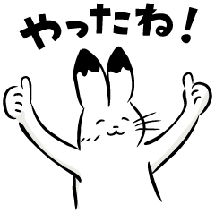

# 英会話この順序で覚えれば絶対だ

> 参考：[**基础知识合集**](lib/basic.html)
>
> 训练：[**例文纯享合集**](all.html)

[TOC]

## <small>[20200430]</small> やった！

**やった！**

**我做到了！**

I did it. / I made it.

 

| 单词 | 发音 |
| ---- | ---- |
| やる | やる |

やります是干某事的那个「干」的意思，是一类动词。自己说自己做到了没必要用敬体，所以用简体就可以。

> やります <small>▶︎</small> やり <small>▶︎</small> やっ <small>▶︎</small> やった

当自己做到一件做了很久或者很难的事情的时候，高兴地自己给自己打气的时候可以说这句话。比如学日语能完成简单的日语对话了，能自己下飞机办完手续（询问外国人入境要到哪个窗口、听懂并配合出示要求的证件、采指纹等）过海关，第一次一定会很开心😄，出来的时候就可以给自己打打气：**やった！**（我做到了！我也能简单地用日语交流啦~）

## <small>[20200210]</small> お久しぶりです。

**お久しぶりです。**

**好久不见。**

It's been a while.

 

| 单词               | 发音       |
| ------------------ | ---------- |
| 久しぶり・久し振り | ひさしぶり |

久しぶり是个名词， 描述的是一种状态，指的是自从上次经过某件事以后过了很长一段时间又发生了同样的事情。振り在这里的意思是「隔了」，久し振り就是「隔了好久」，一般直接写作久しぶり。

作为常用问候语，在前面加上お表示一种礼貌、郑重和美好。名词后面加です结束句子。即，お久しぶりです。一般还会根据使用的语境、氛围，加一些点缀。比如在结尾加个ね，表示惊喜，お久しぶりですね，好久不见啊。

你可以主动说这句话，如果被别人主动说了，也可以直接用同样的话回应。回应完了，还可以补一句，**お元気そうですね**，看起来气色不错啊。元気そう的そう就是「相」，所谓相面看面相，也就是看到你精神的相貌，点个赞，这样就可以从好久不见接着聊下去。

## <small>[20200107]</small> やったね！

**やったね！**

**你做到了！**

You did it! / You made it!

　

| 单词 | 发音 |
| ---- | ---- |
| やる | やる |

やります是一类动词。一类动词变过去式简体，先去掉ます，剩下部分的最后一个假名如果是い・ち・り的话就将其变成促音っ，然后加た。

> やります <small>▶︎</small> やり <small>▶︎</small> やっ <small>▶︎</small> やった

这个词是干某事的那个「干」的意思，比如说日语的工作叫仕事 しごと ，仕事をやります就是干活儿的意思。

其实やります和します是一个意思，都是干某事、做某事的那个动词，只是やります相对粗犷，します比较正式，所以汉语对译的时候，常常把やります翻译成「干 gàn」，而把します翻译成「做」。

やった就是やります的过去式，就是做完了、做成了、做到了。结尾加个语气助词ね，表示一种感叹，类似于汉语中的啦或呀。

当一个人做到了一件挺困难的事情的时候，用来称赞和鼓励对方，可以说这句「やったね！」。

## <small>[20191223]</small> わかった？

**わかった？**

**明白了吗？/ 知道了吗？**

Do you understand?

**わかった。**

**明白了。/ 知道了。**

I understand.

**わからない。**

**不明白。/ 不知道。**

I don't understand.

　

| 单词               | 发音   |
| ------------------ | ------ |
| 分かる・解る・判る | わかる |

わかります是一类动词。一类动词变过去式简体，先去掉ます，剩下部分的最后一个假名如果是い・ち・り的话就将其变成促音っ，然后加た。

> わかります <small>▶︎</small> わかり <small>▶︎</small> わかっ <small>▶︎</small> わかった

在说的时候，疑问句尾向上读，陈述句尾向下读即可。

动词过去式即动词た形。

动词否定式即动词ない形。

一类动词变否定式简体，先去掉ます，将剩下部分的最后一个假名调到あ段，然后加ない。

<small>（あります是特例，あります的否定式简体就是ない，以后遇到再讲）</small>

> わかります <small>▶︎</small> わかり <small>▶︎</small> わから <small>▶︎</small> わからない

可以通过语调表现语气。如果想要加强语气，还可以在句尾加语气助词よ。

> わかったよ。
>
> わからないよ。

以下内容选修：

- 虽然不主张初学者研究方言，但是由于わからない太常用，它的方言又经常出现，这里有必要普及一下。方言没有严格规律可循，我们只能见一个学一个，东京地区（首都圈）的方言 [日本語教科書における「ラ行の撥音化」の扱いについて](http://id.nii.ac.jp/1443/00007810/) 会出现 **将ら行发音发成ん** 的情况，所以 わか**ら**ない 也经常被说成 わか**ん**ない。

- 还有一种方言省略现象：ない <small>▶︎</small> ん。ない的发音是nai，这是三个字母，把ai省略就只剩下了n，わからない就变成了わからん。

- 还有一种方言音变现象：ない <small>▶︎</small> ねぇ。ない读懒了就变成了ねぇ。比如，わからねぇ、わかんねぇ。

## <small>[20191207]</small> わかりましたか？

**わかりましたか？**

**明白了吗？/ 知道了吗？**

Do you understand?

**わかりました。**

**明白了。/ 知道了。**

I understand.

**わかりません。**

**不明白。/ 不知道。**

I don't understand.

 

| 单词               | 发音   |
| ------------------ | ------ |
| 分かる・解る・判る | わかる |

わかる，动词，意思是懂、明白。

わかりましたか就是询问听懂了吗、明白了吗的意思。

肯定回答，听懂了就是わかりました。

否定回答，不明白就是わかりません。

わかる的当用汉字一般写分かる，少数需要精准区分语境时会写解る或判る。

暂时只记平假名写法就行。

## <small>[20191204]</small> さがれ！

**さがれ！**

**退后！**

Stand back! / Get back! / Back off!

 

| 单词   | 发音   |
| ------ | ------ |
| 下がる | さがる |

日语在发号施令的时候，需将命令动词变为命令形使用。

虽然生活中很少命令别人，但命令形在「紧急时刻」比如地震火灾呼喊大家快跑，或者「加油助威」比如看足球比赛让球员快跑，这种场合还是会经常使用的。

下がる这个词有向「下」移动和向「后」移动两种意思。

下がる这个词是第１类动词，第１类动词变命令形，需将该动词的ます形去ます后，再将末尾假名变到え段即可。

比如下がる变ます形是下がります，去掉ます后剩下がり，末尾假名り对应的え段假名是れ，即再把り变成れ即可，也就是下がれ！意思就是命令他人退后，注意要读出命令的口气。

注意：当你用输入法打さがる的时候会出现退がる候选词，但是退がる这个汉字是错误的，日语里さがる的正确当用汉字只有下がる。虽然退がる明显更符合退后的含义，之所以现在不用这个字可能有历史和规范的原因我们不深究，记住要么只写假名さがる，写汉字的话就写下がる即可。

## <small>[20191127]</small> そのまま動くな！

**そのまま動くな！**

**待着别动！**

Hold it!

 

| 单词   | 发音     |
| ------ | -------- |
| 其の儘 | そのまま |
| 動く   | うごく   |

その，意思是那个。まま，意思是状态。そのまま，那个状态。日语汉字写作「其の儘」，一般只写假名。古汉语中「其」就是「那个」的意思；儘就是尽，逝者如斯、万物消尽，所谓自然流转，用以指代状态。

動く，动词，意思是动，泛指有所动作、行动。

日语表达禁止命令的方法是在动词原形后面+な，这种动词变形也被称为禁止形，也就是禁止…、不许… 做某事的意思。比如食べる是吃，食べるな就是不许吃的意思。

そのまま，就是保持原样。動くな，就是不许动。连在一起，直译就是保持原样不许动；为了增强禁止形的气势，我们意译为待着别动！

## <small>[20191126]</small> 足元に気をつけて！

**足元に気をつけて！**

**留神脚下！**

Watch your step!

**手元に気をつけて！**

**手上加小心！**

Watch your fingers!

**頭の上に気をつけて！**

**当心头顶！**

Watch your head!

 

| 单词 | 发音   |
| ---- | ------ |
| 足   | あし   |
| 手   | て     |
| 元   | もと   |
| 頭   | あたま |
| 上   | うえ   |

元（もと）有开始的意思，且古代与圆通用。无论是足元还是手元，都是指从足或手开始周边一圈儿的范围，理解为脚下、手边。

上（うえ）就是汉语上的意思，头的上面不就是头顶么。

以上这三句话可以根据情境理解为「小心地滑」「当心台阶」、「当心夹手」「当心烫手」和「小心碰头」「当心头顶」等。

## <small>[20191121]</small> 気をつけて！

**気をつけて！**

**加小心！**

Be careful.

 

| 单词                           | 发音   |
| ------------------------------ | ------ |
| 気                             | き     |
| 付ける・着ける・漬ける・点ける | つける |

気是只有东亚文明才能理解的一种概念，一种虚无的能量，它发挥作用时又能化生实体。很玄！日语里和気有关的说法不胜枚举，但意思却都是只可意会不可言传的，不能理解的话就先死记住，直到将来有一天能理解它或者不在乎它。

つける是日语中另一个很玄的概念，汉语中的粘、连、黏、随，乃至接触、靠近、浸透、腌制等等意象，都可以用つける来表达。故而，つける的日语当用汉字有很多写法，不一而足。所以，日本人为了避免用字不准，一般也都只写平假名。

那么，気を付ける的意思就是「粘上气」。

我们把动词变成て形+ください，就可以表达请做某事。

比如気をつけてください就是「请粘上气」，而它真正的意思是「请小心一点儿」。我特别喜欢我姥爷的说法，每次我骑车上学他都会嘱咐我「加小心！」，这个「加」字把つける这个词翻译得真好。

另外，つける是二类动词，变て形去掉る（ます）直接加て即可。

## <small>[20191120]</small> 危ない！

**危ない！**

**危险！**

Watch out! / Look out!

 

| 单词   | 发音     |
| ------ | -------- |
| 危ない | あぶない |

危ない是形容词，危险的。常用在遭遇惊险的时候大声喊出。

注意：ない并不是表达否定的那个ない，危ない是一个词，い结尾的い形容词。

## <small>[20191118]</small> 傘をさしました。

**傘をさしました。**

**撑起了雨伞。**

I put up my umbrella. 

**傘を閉じました。**

**合上了雨伞。**

I closed my umbrella.

 

| 单词   | 发音   |
| ------ | ------ |
| 傘     | かさ   |
| 差す   | さす   |
| 閉じる | とじる |

傘，名词，伞。注意写法。

差す，动词，撑开。你看差的羊字头，像不像什么东西撑开的样子。

閉じる，动词，合上。本意是闭合以恢复原样。

## <small>[20191116]</small> 雪が降っています。

**雪が降っています。**

**正在下雪。**

It's snowing.

 

| 单词 | 发音 |
| ---- | ---- |
| 雪   | ゆき |
| 降る | ふる |

## <small>[20191115]</small> 曇っています。

**曇っています。**

**正阴天。**

it's cloudy.

 

| 单词 | 发音   |
| ---- | ------ |
| 曇る | くもる |

## <small>[20191113]</small> 雨が降っています。

**雨が降っています。**

**正在下雨。**

It's rainy.

 

| 单词 | 发音 |
| ---- | ---- |
| 雨   | あめ |
| 降る | ふる |

降る是「一类动词」，意思是降落。

动词变现在进行时，先变て形，再加いる。

变て形先变ます形，去掉ます，末尾假名是いちり，则变促音加て。口诀：いちり、促音变。降り，末尾是り，符合规则。

降る => 降ります => 降り => 降って => 降っている。

为了更加礼貌，いる再变います，即简体变ます形。

降っている => 降っています。

主语是雨，直译是雨正下着，意译为正在下雨。

## <small>[20191111]</small> 晴れています。

**晴れています。**

**正晴。**

It's nice / sunny / beautiful / wonderful.

 

| 单词   | 发音   |
| ------ | ------ |
| 晴れる | はれる |

晴れる是自动词，放晴、晴朗的意思。

日语动词变て形+いる，表示动作的现在进行时。

晴れる是二类动词，变て形直接在ます形去掉ます的基础上加て即可。晴れる、晴れます、晴れて。

晴れている是简体形式，变成ます更加礼貌，即晴れています。天空、天气也好，今天、现在也罢，主语省略了，表达的意思就是正晴着呢。

## <small>[20191110]</small> 彼と会うのが楽しみだなあ。

**彼と会うのが楽しみだなあ。**

**我好期待和他见面啊。**

I'm looking forward to seeing him.

 

| 单词   | 发音     |
| ------ | -------- |
| 彼     | かれ     |
| 会う   | あう     |
| 楽しみ | たのしみ |

彼是男「他」的意思。

会う是见面，所谓相会。

彼と会う，和他见面。

动词原形+の变名词，彼と会うの，和他见面这件事儿。

が，提示前方部分是主语。和他见面这件事儿怎么了？

楽しみです。楽しみ是期待的意思，名词，对于将来可能开心快乐的事情的一种期待。

です简体化变だ，なあ是语气助词。

## <small>[20191106]</small> 週末はどこかへ行きたいなあ。

**週末はどこかへ行きたいなあ。**

**周末好想去什么地方玩儿啊。**

I'd like to take a small trip this weekend.

 

| 单词 | 发音       |
| ---- | ---------- |
| 週末 | しゅうまつ |

どこ，疑问词，哪里。

疑问词+か＝不确定，表达一种不确定的语气，不确定是哪里，反正是个地方。

へ，助词，表示动作的方向。どこかへ，向着不确定是哪里的地方。

行きたい，想去。なあ，语气助词，常常跟在たい后面表达「好想……啊〜」这种感情。

## <small>[20191104]</small> 君のところに行くよ。

**君のところに行くよ。**

**我（这就）去你那儿啦。**

I'll come to your place.

 

| 单词   | 发音   |
| ------ | ------ |
| 所・処 | ところ |

ところ的意思是地方，空间概念。

名词和名词之间加の，表示「的」。

君のところ，你的地方，亦即你所在的地方。

よ，语气助词，表示提醒语气。

## <small>[20191102]</small> 今晩リサと遊びに行くんだ。

**今晩リサと遊びに行くんだ。**

**我今天晚上和丽莎去玩儿。**

I'm going out with Lisa tonight.

 

| 单词 | 发音     |
| ---- | -------- |
| 今晩 | こんばん |

助词と，跟在名词后面，表示和谁、和什么。

リサと，和丽莎。

行くのです。强调语气。

の口语简读为ん，です变简体为だ，行くんだ。

## <small>[20191031]</small> 遊びに行きたい！

**遊びに行きたい！**

**想去玩儿！**

I wanna go out.

 

| 单词     | 发音       |
| -------- | ---------- |
| 遊ぶ     | あそぶ     |
| 遊びます | あそびます |
| 行く     | いく       |
| 行きます | いきます   |

表达想要做某事，将动词变ます形去掉ます加たい。行く是去的意思，行きたい就是想去的意思。

助词に的本质是「点」，是目的、目标的感觉。想去做什么，这个做什么就是去的目的、目标。首先将表达「做什么」的动词变成ます形去掉ます，然后加に就变成了目的、目标的表达。再接行きたい，就是想去做什么。

单纯的遊びたい是想玩儿，而遊びに行きたい是想去玩儿，注意体会。

## <small>[20191030]</small> 元気だよ、君は？

**元気だよ、君は？**

**我挺好呀，你呢？**

I'm fine. How about you?

 

| 单词 | 发音   |
| ---- | ------ |
| 元気 | げんき |
| 君   | きみ   |

君单独用作人称代词，意思是你。但这种说法稍显轻浮，只能对同辈或晚辈使用，对上级或长辈不能使用。

另一种用法是代替さん做称谓词，称呼男性下属或晚辈为某君，比如山田君，此时君读作くん。

## <small>[20191029]</small> 元気？

**元気？**

**过得还好吗？（你好吗？）**

How are you doing?

 

| 单词 | 发音   |
| ---- | ------ |
| 元気 | げんき |

（讲解亡佚，有缘再续）

## <small>[20191028]</small> やあ！

**やあ！**

**嗨！**

Hi!

 

（讲解亡佚，有缘再续）

## <small>[20191027]</small> 起きなさい！

**起きなさい！**

**起床！**

Get up.

 

| 单词   | 发音   |
| ------ | ------ |
| 起きる | おきる |

（讲解亡佚，有缘再续）

## <small>[20191026]</small> ゆうべ遅かったんです。

**ゆうべ遅かったんです。**

**昨天晚上睡晚了。**

I stayed up late last night.

 

| 单词     | 发音       |
| -------- | ---------- |
| 遅い     | おそい     |
| 遅かった | おそかった |

（讲解亡佚，有缘再续）

## <small>[20191025]</small> 眠い！

**眠い！**

**困！**

I'm sleepy.

 

| 单词 | 发音   |
| ---- | ------ |
| 眠い | ねむい |

（讲解亡佚，有缘再续）

## <small>[20191024]</small> 目覚ましが鳴りました。

**目覚ましが鳴りました。**

**闹钟响了。**

The alarm went off.

 

| 单词     | 发音     |
| -------- | -------- |
| 目覚まし | めざまし |
| 鳴る     | なる     |

（讲解亡佚，有缘再续）

## <small>[20191023]</small> 目が覚めました。

**目が覚めました。**

**睡醒了。**

I woke up.

 

| 单词   | 发音   |
| ------ | ------ |
| 目     | め     |
| 覚める | さめる |

（讲解亡佚，有缘再续）

## <small>[20191022]</small> お願いがあるのですが。

**お願いがあるのですが。**

**我有个请求（你看能不能……）。**

Do me a favor.

 

| 单词 | 发音   |
| ---- | ------ |
| 願い | ねがい |

（讲解亡佚，有缘再续）

## <small>[20191020]</small> 手伝っていただけますか？

**手伝っていただけますか？**

**能帮我一下吗？**

Would you help me?

 

| 单词     | 发音       |
| -------- | ---------- |
| 手伝う   | てつだう   |
| 手伝って | てつだって |

（讲解亡佚，有缘再续）

## <small>[20191018]</small> 手伝ってもらえますか？

**手伝ってもらえますか？**

**能帮我一下吗？**

Will you help me?

 

| 单词     | 发音       |
| -------- | ---------- |
| 手伝う   | てつだう   |
| 手伝って | てつだって |

（讲解亡佚，有缘再续）

## <small>[20191017]</small> ちょっとすみません。

**ちょっとすみません。**

**麻烦一下。**

Excuse me.

 

| 单词 | 发音 |
| ---- | ---- |
| 済む | すむ |

（讲解亡佚，有缘再续）

## <small>[20191016]</small> お願いします。

**お願いします。**

**拜托了。（靠你了。）**

Please.

 

| 单词 | 发音   |
| ---- | ------ |
| 願い | ねがい |

（讲解亡佚，有缘再续）

## <small>[20191015]</small> 何か甘い食べ物が欲しい。

**何か甘い食べ物が欲しい。**

**我想吃甜的东西。**

I want something sweet to eat.

**何か冷たい飲み物が欲しい。**

我想喝凉的东西。

I want something cold to drink.

 

| 单词   | 发音     |
| ------ | -------- |
| 何     | なに     |
| 何か   | なにか   |
| 甘い   | あまい   |
| 食べ物 | たべもの |
| 欲しい | ほしい   |
| 冷たい | つめたい |
| 飲み物 | のみもの |

（讲解亡佚，有缘再续）

## <small>[20191014]</small> 何か食べ物が欲しい。

**何か食べ物が欲しい。**

**我想吃东西。**

I want something to eat.

 

| 单词   | 发音     |
| ------ | -------- |
| 何     | なに     |
| 何か   | なにか   |
| 食べ物 | たべもの |
| 欲しい | ほしい   |

（讲解亡佚，有缘再续）

## <small>[20191012]</small> お腹がペコペコです。

**お腹がペコペコです。**

**我快饿死了。**

I'm starved.

 

| 单词 | 发音   |
| ---- | ------ |
| お腹 | おなか |

（讲解亡佚，有缘再续）

## <small>[20191011]</small> のどが渇きました。

**のどが渇きました。**

**我渴了。**

I'm thirsty.

 

| 单词       | 发音   |
| ---------- | ------ |
| 渇く・乾く | かわく |

（讲解亡佚，有缘再续）

## <small>[20191010]</small> お腹がすきました。

**お腹がすきました。**

**我饿了。**

I'm hungry.

 

| 单词 | 发音   |
| ---- | ------ |
| お腹 | おなか |
| 空く | すく   |

（讲解亡佚，有缘再续）

## <small>[20191009]</small> すみません。お手洗いはどこですか？

**すみません。お手洗いはどこですか？**

**不好意思。（请问）洗手间在哪里？**

 

（讲解亡佚，有缘再续）

## <small>[20191007]</small> 初めまして。私は __ です。

**初めまして。私は __ です。中国から来ました。どうぞよろしく。**

**初次见面。我是 __ 。我来自中国。请多关照。**

 

| 单词     | 发音       |
| -------- | ---------- |
| 初める   | はじめる   |
| 私       | わたし     |
| 中国     | ちゅうごく |
| 来ます   | きます     |
| 来ました | きました   |

（讲解亡佚，有缘再续）