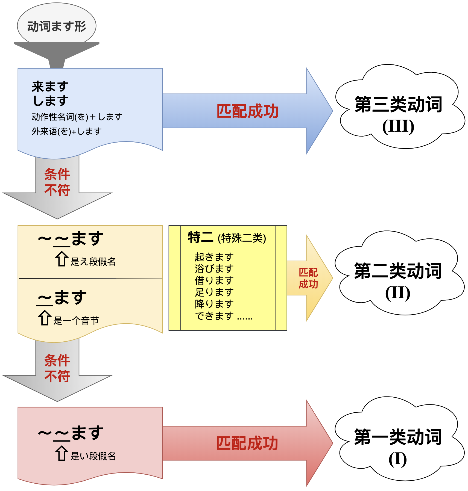
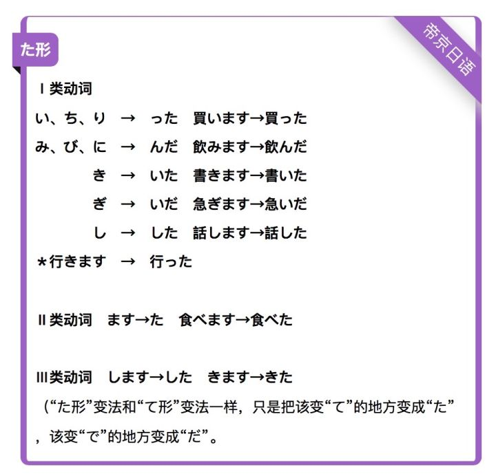

# 基础知识合集

[TOC]

## 平假名与片假名

> 参考：[**五十音记忆练习**](kana.html)

 

 

## 动词分类

> 参考：[**一类vs一段：日语动词分类，你学哪种？**](http://www.sohu.com/a/334555935_665459)

- 日语中单个动词的结构为：

  > **食 <small>(词干)</small> べ <small>(附加)</small> ます <small>(后缀)</small>**

  **词干** 体现 **「意思」**，**附加** 体现 **「变形」**，**后缀** 体现 **「时态和形式（简体和敬体）」**。

- **后缀为ます的动词形态即为动词的ます形。**

- 《大家的日语》教材采用ます形作为动词分类和变形的基础。

- 《大家的日语》教材将日语动词分为三类。

 

## 动词变形

 

 

### ない形

 

### て形

 

### た形

 

### 字典形

 

### 命令形

 

### 禁止形

 

### 条件形

 

### 意向形

 

### 可能形

 

### 使役形

 

### 被动形 

 

### 使役被动形

 

## 形容词分类及变形

