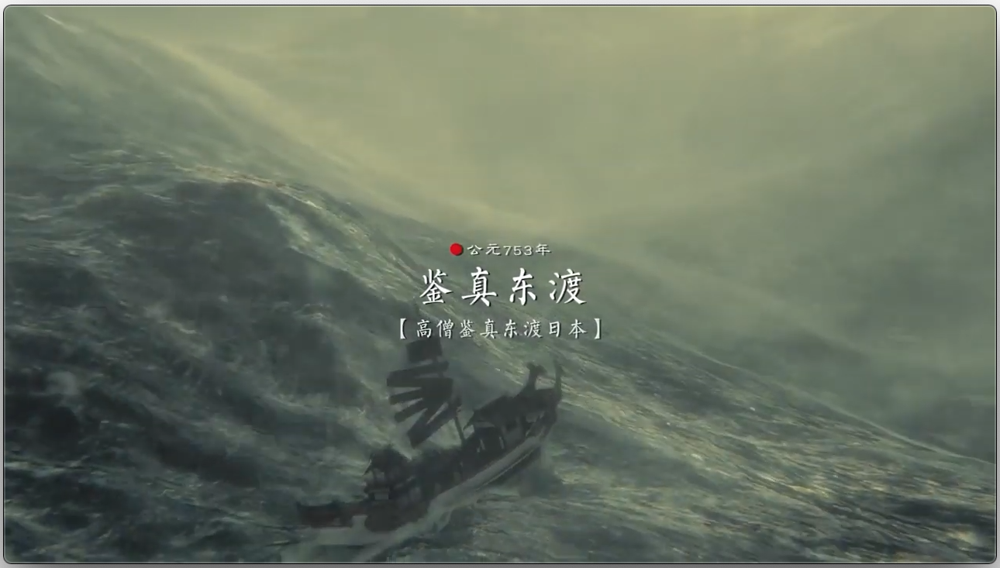
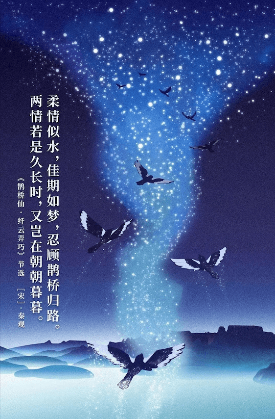
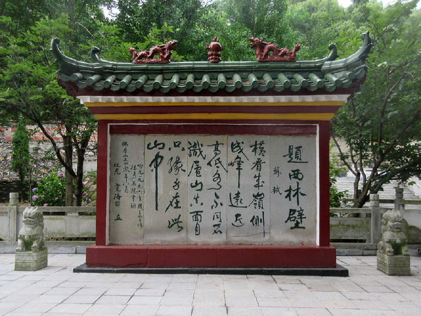
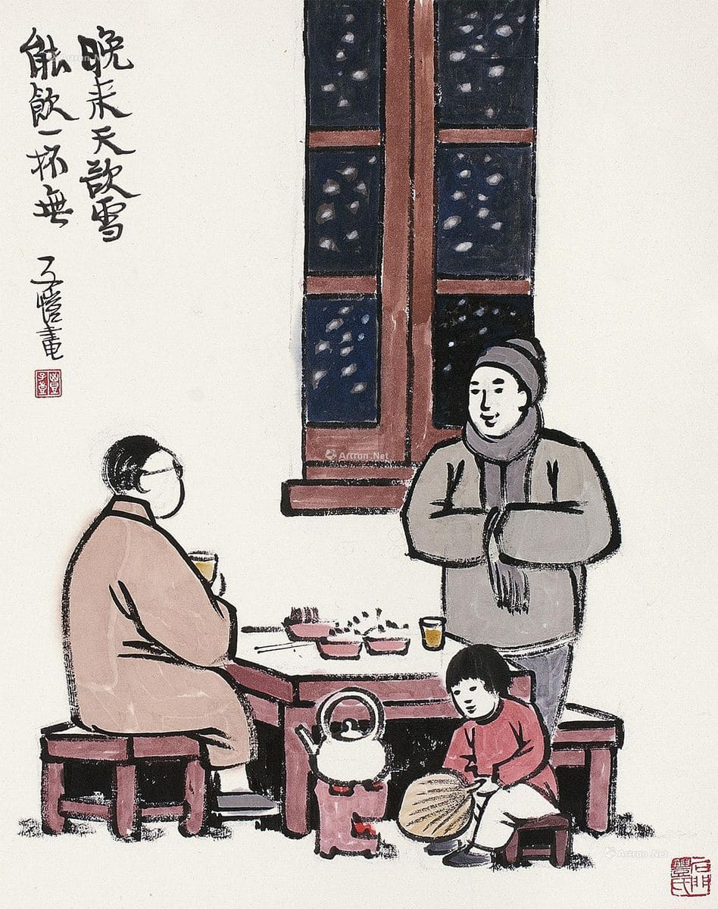
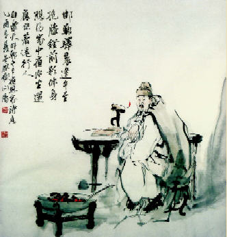

# 婷婷唱古文

> 喜马拉雅：[**婷婷唱古文**](https://www.ximalaya.com/ertong/3533672/)
>
> 课外读物：[**唐之韵**](lib/tangzhiyun.html)

[TOC]

## <small>[2020]</small> 准提咒 (东周) 释迦牟尼

**拿魔卅多难，三邈三匍跎。居之难，达乍脱。唵，辄离诸戾，谆惕所哈。**

擒拿心魔，世多苦难，三千邈远，斗折蛇行。

居持艰难，顿入解脱。

果成，便离诸执着愚痴，恳慎言辞捭阖。

## <small>[2020]</small> 仙剑1

**既不回头，何必不忘。既然无缘，何须誓言。今日种种，似水无痕。明夕何夕，君已陌路。**

## <small>[2020]</small> 绣袈裟衣缘 (唐) 長屋王

**山川异域，风月同天。寄诸佛子，共结来缘。**

 

<small>[**听歌曲**](https://music.163.com/#/song?id=1421502737)</small>

（待续）

 

住む場所は異なっていても、風月の営みは同じ空の下でつながっている。

## <small>[20200428]</small> 鹊桥仙·纤云弄巧 (北宋) 秦观

**纤云弄巧，飞星传恨，银汉迢迢暗度。金风玉露一相逢，便胜却人间无数。**

**柔情似水，佳期如梦，忍顾鹊桥归路。两情若是久长时，又岂在朝朝暮暮。**

 

<small>[**听歌曲**](https://www.ximalaya.com/ertong/3533672/19631273)</small>

以前一直在讲诗，今天换换口味，讲首宋词。

词最初是伴曲而唱的，词与曲之间，或按词谱曲，或按曲填词，最后再根据词的内容为作品起个名字，一般都是三个字，这就是最早的词牌。经过不断发展，便产生了很多词牌，利用现有曲调来填词逐渐成为主流，词的内容与词牌也慢慢不再相关。当词完全脱离曲之后，词牌便只是作为文字、音韵、平仄结构的一种定式。比如方文山作词、周杰伦作曲的《青花瓷》，在古代就相当于首创了一个词牌，歌名自然也是根据歌词起的。《青花瓷》火了，引来热心网友给这首歌重新填词，可能就会出现《青花瓷·无可奈何花落去》，曲子还是一样，歌词句式也没什么差别，想必宋朝的文人作「词」，流程大抵如此。我们介绍的时候就会说这首新词的词牌名是「青花瓷」，词的标题是「无可奈何花落去」，词的内容和青花瓷（词牌名）可能没有任何关系。

今天讲的这首词是北宋词人秦观的《鹊桥仙·纤云弄巧》，词牌名是「鹊桥仙」，词的标题是「纤云弄巧」。这首词的内容和词牌是相关的，写的就是牛郎织女鹊桥相会，但是表达的却是秦观的爱情观。

这秦观又是何许人呢？秦观（1049年—1100年），字少游，他是苏轼的学生，苏轼很欣赏秦观，把他和自己另外三个学生成立了个组合，叫[**「苏门四学士」**](https://baike.baidu.com/item/苏门四学士)，老师还亲自宣传。（如<u>黄庭坚</u>鲁直、<u>晁补之</u>无咎、<u>秦观</u>太虚、<u>张耒</u>文潜之流，皆世未之知，而轼独先知。）众所周知，苏轼的词豪气干云，是豪放派大师，然而「苏门F4」之一的秦观，日后却成为了婉约派的一代词宗，也是一段佳话。秦观和老师苏轼一样是一生坎坷，其所写诗词，高古沉重，寄托身世，含蓄缜密，感人至深。

秦观生平暂且按下不表，关于这首词的来历，说法众多，有说是宦游在外的秦观为夫人所作，也有说是取道长沙的秦观为歌女所作，但总的主题还是相知不能相守的异地恋情。我们且看这首词。

**纤云弄巧，飞星传恨，银汉迢迢暗度。**纤，细小、轻盈。所谓纤云弄巧，即是轻盈柔软的云彩，变换出许多优美巧妙的图案。二人银河相隔，那些飞驰的流星仿佛都在传递着他们的离愁别恨。「迢迢」二字形容银河的辽阔，二人相距之遥远，以空间之远反衬相思之苦。暗度点了七夕，夕就是夜晚。当然，王母娘娘因反对仙凡结合，才用簪子划下了这银河，二人见面也只能是悄悄渡河相见，也可解作「暗度」。

**金风玉露一相逢，便胜却人间无数。**体会一下什么叫宕开笔墨！这一刻，清风如金子一样珍贵，露水像美玉一般光洁。金风玉露之夜，碧落银河之畔，一对久别的情侣相会了，这美好的一刻，便抵得上人间千遍万遍的相会了。

词分两阙，上阙方相会，下阙即离别。

**柔情似水，佳期如梦，忍顾鹊桥归路。**相聚短暂，马上又要分开，那情意啊，就像悠悠无声的流水，温柔缠绵。二人在银河之畔相会，这「柔情似水」也是即景设喻，十分自然。一夕佳期竟然像梦幻一般倏然而逝，才相见又分离，怎不令人心碎！刚刚借以相会的鹊桥，转瞬间又成了和爱人分别的归路。不说不忍离去，却说怎忍看鹊桥归路，婉转语意中，含有无限惜别之情，含有无限辛酸眼泪。

**两情若是久长时，又岂在朝朝暮暮。**秦观之词，佳期幽会，如梦似幻，及至鹊桥言别，恋恋之情，已至于极。词笔至此忽又空际转身，爆发出高亢的音响。**爱情要经得起长久分离的考验，只要能彼此真诚相爱，即使终年天各一方，也比朝夕相伴的庸俗情趣可贵得多。**

……

无论什么时代，异地恋都是奢侈的爱情，当你下次再听说谁家孩子正处异地恋中时，会不会想起这首「两情若是久长时，又岂在朝朝暮暮」呢？

## <small>[20200214]</small> 咏雪 (唐) 张打油

**江山一笼统，井上黑窟窿。黄狗身上白，白狗身上肿。**

 

<small>[**看视频**](https://www.bilibili.com/video/av21307758/)（《铁齿铜牙纪晓岚4》第18集片段）</small>

入冬了，北方的雪是免不了的。然而在所有写雪的诗中，有这样一首妙趣横生，甚至开创了一个流派的诗，这就是我们今天要讲的这首《咏雪》。

先看诗。

**江山一笼统。**江上结冰，山坡覆雪，远近一色，岂不是混沌笼统。

**井上黑窟窿。**井上有口，井里深呀，雪落其中，只见一个黑窟窿。

**黄狗身上白。**黄色的狗，皮毛上顶着层白雪，就像变成了白狗。那白狗呢？

**白狗身上肿。**白狗本来就是白色，但是皮毛上又顶了一层白雪，就像肿了一样。

这首诗相传是唐代中期的张打油所作，人物生平不可考，张打油这个名字也可能是化名。相传这个人喜欢写诗，作品却不怎么上台面，格律也不甚工整，但文辞浅白，且结尾处总有奇趣，所以妇孺口口相传，倒也传了千年。甚至后世诗文败落，百姓兴起而作的那些不讲究平仄格律的歪诗，也自诩为**「打油诗」**，意即像张打油那样写的诗（可不是打油时写的诗），而这首《咏雪》也被公认为打油诗鼻祖。

然而即便不讲究平仄格律，也就是读起来有点儿拗口、字数也不一定匹配的所谓打油诗中，也是有高下之分的。比如相传张打油还写过这首诗：

> **六出九天雪飘飘，恰似玉女下琼瑶。**
>
> **有朝一日天晴了，使扫帚的使扫帚，使锹的使锹。**

乍一看这是诗吗？字数都不对。不过想想李白的《将进酒》字数也不对，不影响其成为千古名篇。如果是《咏雪》是上品，张打油这首使锹的诗，就算得上是打油诗中的中品了，而后世所谓民间打油诗，大多数只能是下品。为什么这么说？打油诗牺牲了一些音韵、对仗的美感，是为了追求奇趣，如果一首诗不讲平仄格律也就罢了，平平无奇，白白如话，那还剩什么呢？张打油的诗，总算还有奇趣。

关于使锹这首诗还有后续。当时县太爷在寺庙的墙壁上看到这首诗，非常生气，这不是破坏公物吗？而且诗的水准还不咋地。便命师爷调查元凶，哪知师爷一看就说肯定是张打油写的，别人写不出来这种歪诗。于是叫来张打油，张打油自然死不承认，还说我怎么能写得出这种烂诗呢。县太爷就说那我现场出题你来作诗证明你的清白，就写南阳战事。当时正值唐朝「安史之乱」，叛军被官军围困南阳。于是张打油张口就来：

> **百万贼兵困南阳，也无救援也无粮。**
>
> **有朝一日城破了，哭爹的哭爹，喊娘的喊娘。**

这几句一出不就破案了嘛，还证什么清白，结果哄堂大笑，连县太爷都给逗乐了，反倒饶了张打油这次，张打油也从此远近闻名。

无论是使锹还是喊娘，张氏的打油诗都有这样的特色：开篇大气磅礴，接续差强人意，再来急转直下，最后接上地气。接地气，反差萌，这才是真正的打油诗。

最近新型肺炎闹得紧，闲来听首武汉歌手冯翔的歌曲[**《汉阳门花园》**](https://music.163.com/#/song?id=421148387)，歌词中有这么几句：

> **冬天腊梅花，夏天石榴花。**
>
> **晴天都是人，雨天都是伢。**

伢是武汉方言，也就是小孩儿的意思。这汉阳门花园的场景，是不是跃然纸上？像不像这首《咏雪》，这才是我心中打油诗的上品。

当你下次再看到身上落着雪的小狗儿时，会不会想起这首上品打油诗呢？

## <small>[20200106]</small> 一念一生 (当代) 李健

**你可曾听说过雪山悬崖，**

**曾让人魂绕梦牵。**

**传说中有宝藏在上面，**

**也藏着万丈深渊。**

**聪明的、愚笨的、善良的人，**

**都是你熟悉的人。**

**在山坡、在悬崖、在巅峰云端，** 

**在这人世间。**

 

<small>[**听歌曲**](https://haokan.baidu.com/v?vid=4992659860175934589)</small>

李健在音乐圈素有「音乐诗人」称号，他的很多作品如《传奇》《风吹麦浪》《贝加尔湖畔》等颇具诗意。元旦休假期间，我观看了电视剧《庆余年》，也听到了李健为这部剧量身定做的主题曲《一念一生》。这首主题曲本来很长，歌词暗合小说剧情，但作为电视剧片头只截取了完整版的其中几句，却令其诗意超越剧情。

所以，如果撇开剧情的话，这首诗又讲了一个什么故事呢？

**你可曾听说过雪山悬崖，曾让人魂绕梦牵。**你有听说过雪山悬崖这个地方吗，曾经多少人都心向往之。哦？为什么呢？

**传说中有宝藏在上面，也藏着万丈深渊。**有人说上面藏了宝贝，不过想要去找到它也很危险，一不小心就会跌落山崖，粉身碎骨。哎！那都是什么人去了那儿呢？

**聪明的、愚笨的、善良的人，都是你熟悉的人。**什么人都有，无论聪明的、愚笨的或者善良的，其实他们你都熟悉。是吗？那他们都在哪儿呢？

**在山坡、在悬崖、在巅峰云端，在这人世间。**他们有的在山坡还在赶路，有的在悬崖命悬一线，有的已经到了巅峰，伸手能碰到云朵。其实，他们就在这人世间。

看懂了吗？短短几句其实写尽人生。用雪山比喻人间，人间正是宝藏与艰险并存，多少人都想找到心中的宝藏，那些登山的人便是你、是我、是熟悉的人。我们并不认识啊？可是这些人的聪明、愚笨、善良，你其实很熟悉吧，这不就是人性吗？这些人各自处在不同的阶段，有的暂时平安，有的正遇危险，有的高处不胜寒。他们在这山上，你其实不也在这山上吗？你又在哪儿呢？你的宝藏找到了吗？

电视剧片头曲截取的歌词里其实还有一句，在一段「**呜〜**」的咏叹之后，「**让雪花纷纷扬扬**」。我未把这句编进诗中，因为直感觉会破坏诗的整体感，还把底牌交了，少了思考空间。说到底宝藏也好，深渊也罢，多少人这一生或风光无限，或颠沛流离，最终还不是「落了片白茫茫大地真干净 [[1]](https://baike.baidu.com/item/收尾·飞鸟各投林/8167114)」？这便是人生的底牌，可能也会是整个人类的结局。

当下次有人想和你聊聊人生这种话题的时候，不妨把这个雪山悬崖的故事讲给他听，然后问问他：你的宝藏找到了吗？

对了，你的宝藏找到了吗？

## <small>[20191225]</small> 题西林壁 (北宋) 苏轼

**横看成岭侧成峰，远近高低各不同。不识庐山真面目，只缘身在此山中。** 

 

<small>[**听歌曲**](https://www.ximalaya.com/ertong/3533672/19293892)</small>

知人论世，先聊聊苏轼。北宋自960年陈桥兵变，赵匡胤黄袍加身建立，到1126年靖康之难，次年（1127年）被金国灭亡，传帝九位，享国167年。苏轼，字子瞻，1037年－1101年，一生经历颇为坎坷，也造就了豪放豁达、感情丰富、文采斐然的大学士苏东坡，此后又有明朝朱右、唐顺之、茅坤等人推崇其为唐宋八大家（**韩柳欧王曾三苏**）之一。

宋以前的诗歌传统是以表达志向（言志）、抒发情感（言情）为特点，到了宋朝尤其是苏轼，则出现了以寄寓理趣（言理）为特色的新诗风。这首诗写于1084年，苏轼当时47岁。此前苏轼先是经历了「熙宁变法」中与宰相王安石政见不合而遭到排挤，又在针对他的「乌台诗案」中差点被文字狱整死，所幸捡回性命被贬湖北黄州任个虚职。到今年宋神宗皇帝打算宽宥一下苏轼，把他从湖北黄州调到了河南汝州，要知道北宋的都城在河南开封。赴任途经江西九江，便和朋友共游庐山。苏轼一路观赏山景，见层峦叠嶂，移步换形，不但距离远近、形势向背各有不同，高低起伏、姿态形象更是变化无穷。行至庐山西林寺，寺中僧俗知道大名鼎鼎的苏轼来了，向其索诗，于是苏轼便索笔在西林寺的墙壁上写下了这首《题西林壁》。

 

我们看诗。

**横看成岭侧成峰，远近高低各不同。**庐山是座丘壑纵横、峰峦起伏的大山，横着看就是连绵的山岭，侧过来再看就只能看见高耸的山峰，而且距离远近、高低起伏各有不同。所谓移步换形，游人所处的位置不同，看到的景象也各异，换个角度看问题，答案可能完全不一样。

**不识庐山真面目，只缘身在此山中。**要是只有前两句，恐怕谁都能写出来，但苏轼之所以是苏轼，就在于最后这两句的价值。横、侧、远、近、高，低，苏轼换了六种视角看庐山，然而，他看明白了吗？并没有。反倒更加糊涂了。每个视角看到的庐山都不一样，这就像盲人摸象，你永远不可能了解真正的庐山究竟是什么样的，你多换一种视角也只是再多一种景象罢了，因为这些视角都是在这山中看的，北宋是没有航拍设备的，你永远看不全。

苏轼这首诗不只是他庐山旅游的总结，其实也是他半生仕途的总结，他身在大宋的官场却看不清官场，一身才华学问却看不清自己的未来，在黄州这几年总是找不到自己的定位，这次调往汝州，对自己又意味着什么？时来运转吗？再度贬谪吗？当局者迷，也只能感慨一声了解真相太难了。

如果你觉得现在有了飞机，我们已经可以了解庐山真面了，那么听我讲下一个故事。

1977年，美国宇航局发射了一个名为「旅行者1号」的探测器，朝着太阳系的边缘地带飞去。在他飞近太阳系边缘的时候，照相机重启并回头给太阳系拍摄了一张全家福，不过在这张照片上，地球也只是剩下了几个像素大小的光斑 [[1]](https://baike.baidu.com/item/暗淡蓝点/5316843) ，相比之下人类实在是太渺小了。旅行者1号是目前飞离地球最远的航天器，2013年9月才飞出了太阳风的势力范围（以后它的身边再也没有来自太阳的物质了），算是飞出太阳系 [[2]](http://www.spaceflightfans.cn/17933.html) 了。大约7万年以后，将经过半人马座比邻星（目前离太阳系最近的恒星），也就是《流浪地球》中的目的地，地球的新太阳。最后朝着银河系中心驶去，而整个银河系大概有上千亿颗恒星。

地球处在太阳系中，太阳系处在银河系中，你有没有看过银河系的照片？你搜一搜，它可能长这样。

 

然而，这其实并不是银河系，我被这张照片骗了很久。直到最近才知道，这其实是用望远镜观测到的距离银河系最近的仙女座星系，我们人类的飞行器都没飞出过银河系，谁来给我们的银河系拍照？所以我们永远都不可能知道银河系真正的样子。我们仍然是「不识庐山真面目，只缘身在此山中」。

我们从何处来？我们是谁？我们向何处去？人类的始末，宇宙的真相，人类自身想要追求这些问题的答案，难就难在我们就是问题本身，而我们永远无法跳到宇宙外面。此前，我曾尝试思考并建构了一套世界观，认为「世界就是一个游戏」，我们都是这个游戏的玩家。这个游戏不能自由进入，只能由游戏中达到一定级别的一对异性玩家邀请新玩家的方式才能进入游戏（生命繁殖系统）。甚至对关于游戏场景的即时渲染引擎（量子力学）、光速不可突破（CPU性能极限）、时间的产生（服务器重启）、地府（游戏大厅，等待邀请进入游戏）、轮回（新一局游戏）、生死簿（防沉迷系统）、十八层地狱（恶劣玩家黑名单）等等构想的完善，都是想要在山中想象整座山的真相。

当你下一次仰望星空，思考着人类的何去何从和宇宙世界的本质时，会不会想起这首诗呢？

## <small>[20191210]</small> 问刘十九 (唐) 白居易

**绿蚁新醅 pēi 酒，红泥小火炉。晚来天欲雪，能饮一杯无？**

 

<small>[**听歌曲**](https://www.ximalaya.com/ertong/3533672/142630000)</small>

上回说到，白居易四十四岁以后，远离政治，不再创作讽喻诗。晚年的白居易，选择了退休养老，在洛阳置田产房宅，过起了十分舒适安逸的老年生活。诗人总能发现诗意，这不，就在一个雪天儿，简单准备一桌，写个信儿约好朋友刘十九来喝酒，也能成为千古名篇。题目叫问刘十九，其实就是问刘十九你要不要来喝酒。

我们看诗。

**绿蚁新醅 pēi 酒，红泥小火炉。**诗风是很难改的一件事儿，白居易用浅显直白、通俗易懂的语言写了半辈子新乐府，到老了还是这个风格。这两句把饭局的主要内容介绍一下，简单却韵味十足，尽显其「诗魔」属性。所谓醅酒，就是指新酿的没有过滤的酒。酒面还浮着酒渣，色微绿，细如蚁，所以叫绿蚁。连上下一句红泥小火炉，说白了就是我最近自己新酿了点儿酒，自己喝就不滤了，连带着烫酒用的红泥烧的小炉子我也支好了。

**晚来天欲雪，能饮一杯无？**天儿也快晚了，我看好像要下雪，过来一起喝一杯不？

你想想，刘十九收到信拆开一看：老白自个儿酿的酒，还把小火炉也拿出来了，天眼瞅就黑，马上就得下雪，这天儿烫点儿酒喝、扯扯淡也太爽了吧，还问我来不来，你等着我就到。哈哈，是不是令人无法拒绝？

雪天天生带有浪漫属性，而「雪天约酒」这件事儿则是在大自然的浪漫中融进了人情。酒是绿，火是红，夜是黑，雪是白。酒是新酒，炉是小炉，屋外寒冷，屋里暖和，雪夜寂静静，我们闹哄哄。我尤其喜欢「红泥小火炉」一句，酒已经很诱人了<small>（老白新酿的，会是什么味道啊？）</small>，而粗拙小巧的炉火又增添了温暖的情调。白居易对意象顺序的巧妙编排，用色彩让你仿佛见到了酒，感到了温，用土语却不见俗，真是点铁成金手段。

 

想起来一八年买了一口铸铁珐琅锅，温度均匀，密封极好，仅是切好蔬菜放里不放水，加小火便能做成鲜浓蔬菜汤。当时，老朋友赵天雨就住在我家附近。我发微信给他，新买的锅炖肉、新学的蒸馒头、下点儿小雨儿来吃不。然后我们度过了一个愉快的周末，这不就是现实版的问赵天雨吗？

当你下一次邀请朋友来家吃饭，或者一同寒夜小酌之时，会不会想起这首诗呢？

## <small>[20191205]</small> 邯郸冬至夜思家 (唐) 白居易

**邯郸驿里逢冬至，抱膝灯前影伴身。想得家中夜深坐，还应说着远行人。**

 

<small>[**听歌曲**](https://www.ximalaya.com/ertong/3533672/145292106)</small>

知人论世，先聊聊白居易。白居易，字乐天，772年－846年，历时七年的安史之乱在763年平定，也就是说白居易刚好出生在一个乱局初平、百废待兴的时代。到唐宪宗李纯继位，安史之乱过去半个世纪后，出现了「元和中兴」的小盛世局面，然而这只是唐王朝的一次回光返照，之后的唐朝虽还有小规模中兴，但更多呈现的是大势已去。白居易，生于安史之乱后的中唐时期，经历了元和中兴，所以说白居易是中唐诗人的代表。

正是百废待兴的中唐，孕育了白居易和他的新乐府诗派。所谓乐府，就是古代的国家唱诗班，他们到全国各地采风，收集诗歌整理编曲以广为传唱，所以乐府诗天然地接地气。新乐府诗就是模仿以前的乐府诗，主张诗歌要为政治服务，关注民生，揭露弊政，期望革除弊端，中兴王朝。为了充分起到宣传作用，这一派的另一个特点就是主张用浅显直白、通俗易懂的语言来写诗。据说白居易写诗一改再改，一直改到不识字的老妇人都能听懂为止。

然而写这样的诗必然得罪权贵，四十四岁时，白居易遭到了报复，被贬为江州司马。之后的白居易变了，开始学着独善其身，热情不再，最后的倔强和挣扎化作了《琵琶行》，而终章只是「江州司马青衫湿」，可见他的心已经凉透了。

白居易先聊到这儿，回来说白居易写这首诗时三十三岁，刚刚步入仕途，官职叫校书郎，在国家机关（秘书省）做校对工作。冬至这天，朝廷放假，民间也很热闹，一派过节景象。但白居易当时正在外地出差，夜宿于邯郸驿馆之中，故有感而作此诗。

我们看诗。

**邯郸驿里逢冬至。**白居易写诗，文辞都很简单，这句话就是说我在邯郸的招待所里正好赶上了冬至。

**抱膝灯前影伴身。**冬至天儿冷啊，现在冻得我抱紧膝盖，缩作一团坐在油灯前。我一个人在外出差，孤单寂寞冷，灯光一照，也就只有影子陪伴着我了。

**想得家中夜深坐，还应说着远行人。**冬至佳节，自己出门在外，想必家里人也过得很不愉快。当自己抱膝灯前，想念家人的时候，想着家里人大概也同样没睡，直到深夜还坐在灯前谈论着我这个远行之人吧。

说说我的体会。

日本冬天不供暖，天寒地冻，也只能自己开空调或者点灯油炉子。这个灯油炉子火一着，像极了白居易面前那盏油灯，我就抱着膝盖坐在炉前烤火，回头也只有我的影子。每当此时，我就会想，要是我在家，我妈这刻应该煮饺子呢吧，就会想现在我妈是不是一边儿做饭也一边想我呢？于是很自然地就会想起这首《邯郸冬至夜思家》，一个人又呢喃几遍，不了了之。

我不禁感叹，只有真正经历过「独在异乡为异客」，才能真实地了解「每逢佳节倍思亲」是一种什么感觉。我们在国内上学时充其量只能算是「异乡」，却并不能算「独在」和「异客」，因为有宿舍室友，过得还是集体生活，也都是同胞。来到日本之后，自己租房生活，才真正补上了「独在」和「异客」这两个条件，才发现自己以前根本不懂思乡之情。

这样我才明白，所谓思念朋友为什么是「遥知兄弟登高处，遍插茱萸少一人」。国内的老朋友们又聚会了，拍合影发朋友圈，唯独缺我自己。

这样我才明白，所谓思念家人为什么是「想得家中夜深坐，还应说着远行人」。你可能没机会问过他们是否真得半夜睡不着觉还在聊着你，但你就是这么觉得。

我小时候跟小伙伴儿们在外边玩儿，玩儿累了，想回家了，就会跟他们说「我妈该叫我吃饭了」，然后马上回家。生活中自有诗意，「我妈该叫我吃饭了」不正是孩童版的「想得家中夜深坐，还应说着远行人」吗？

我想我妈了。你有想念的人吗？她也在想着你吗？当你想到他们时，会不会想起这首诗呢？

## <small>[20191202]</small> 鹿柴 zhài (唐) 王维

**空山不见人，但闻人语响。返景 yǐng 入深林，复照青苔上。**

 

<small>[**听歌曲**](https://www.ximalaya.com/ertong/3533672/25064692)</small>

知人论世，先聊聊王维。唐朝自618年李渊称帝建立，到907年朱温篡唐建立后梁灭亡，国运289年。其间，出现了「文必秦汉，诗必盛唐」中的开元盛世，大概从713年持续到741年。王维，701年－761年，经历了整个盛唐时代。

王维，名维，字摩诘。王维的名和字都取自佛教大居士维摩诘，维摩诘当然是音译。王维母亲笃信佛教，王维自然受其熏陶，维摩诘又是佛教中很另类的菩萨，有妻有子过世俗生活，修行讲究不二法门，可说是佛教的天才人物。王维一生与佛有缘，除了诗歌，其书法、山水、篆刻、音乐具是绝顶，同是天才人物。

王维因其艺术涉猎广泛，造诣极高，融会贯通，以致「诗中有画，画中有诗」境界，加之佛法修为，诗中透着机锋禅理，当真难得。

王维四十多岁时买下了辋川山谷的一座山庄，给老母奉佛修行，同时自己半官半隐，穿梭于朝廷官府和山水田园之间。期间，他和好友裴迪闲时逛逛山庄，然后就山庄的二十处景点各自写诗，其中就有鹿柴、竹里馆、辛夷坞等，然后结成诗集，叫做《辋川集》。鹿柴，柴就是寨，想必是王维山庄里一处林中小屋。

我们看诗。

**空山不见人。**空山，便不简单。空义不是无，而是旷，想旷就得大，想旷就得深，想旷就得远，才能人迹罕至，浑然天成。王维号称「诗佛」，空字透着佛性。

**但闻人语响。**这样一座大空境见不到人，已经觉得很安静了吧。这样就完了吗？不，王维的厉害在于别人写静就到此为止，不动响器，王维偏偏要出点声音。见不到人，却偶尔还能听见一些人说话的声音，大山之中，你不见我，我不见你，但我知有你，只因尔言入我耳，这手法我只能说太炫了。所谓「以动写静而静愈静」，这屋子一个人都没有，一根针掉地上的声音都能听见，大概就是这种感觉吧。以局部的、暂时的「响」反衬出全局的、长久的空寂，动之一时，寂之万古。

**返景入深林，复照青苔上。**日光曰景，日西落，光返照于东，谓之返景。景就是影，返影就是太阳将落时透过云层散射的阳光<small>（[**丁达尔效应**](https://baike.baidu.com/item/丁达尔效应/5627143)）</small>。夕阳的金光直射入深林，又照在幽暗处的青苔上。林外为阳，林内为阴，林深少日，方长青苔，平时难见，此刻夕阳照至，苔痕深碧，残阳浅红，阴阳和合，相映生辉。

当你下一次走进深山，行至一处无人深林，见夕阳余晖撒向林间，会不会想起这首诗呢？