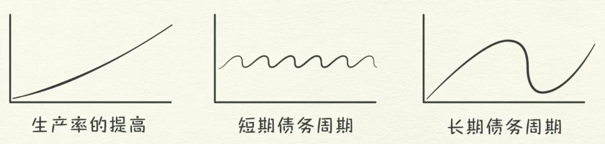

## 经济机器

> 网易公开课：[**经济机器是怎样运行的**](http://open.163.com/newview/movie/free?pid=MBPO9ED98&mid=MBPO9S8IQ)

#### 机器

- 经济以简单和机械的方式运行。

- 经济由几个简单的零部件和无数次重复的简单交易组成。

- 交易由人的天性驱动。

- 因交易形成了三股主要的经济动力：

    

  - 生产率的提高。
  - 短期债务周期。
  - 长期债务周期。

#### 交易

- 交易：买方使用货币或信用向卖方交换商品、服务或金融资产。
- 支出总额：货币 + 信用。
- 价格：支出总额 / 产销总量。
- 交易是经济机器的最基本零件，所有的经济周期和动力都是交易造成的。
- 一个市场，由买卖同一种商品的所有买方和卖方组成。
- 经济就是由所有市场内的全部交易构成。
- 全部市场的总支出和销量，就是了解经济运行所需要的全部信息。

#### 政府

- 政府是最大的买方和卖方。
- 政府有两个组成部分：
  - 收税和花钱的中央政府。
  - 中央银行。